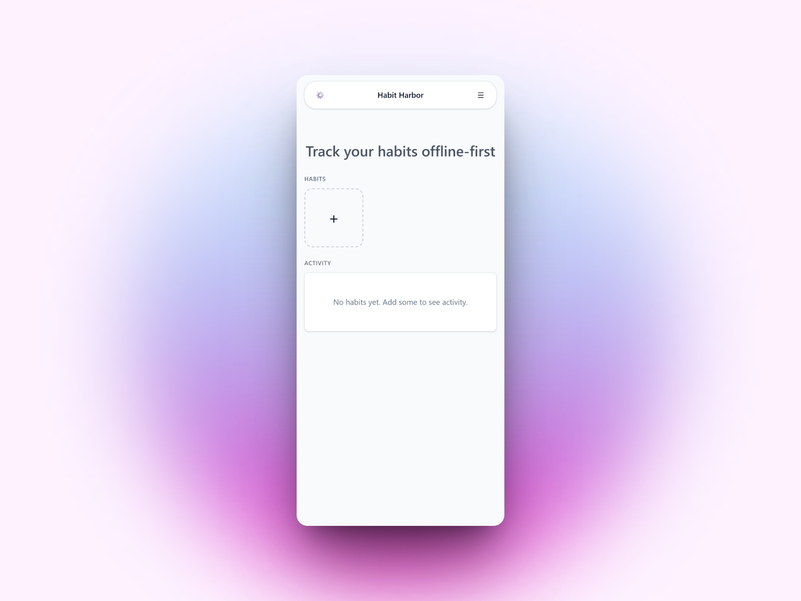

# Habit Log (Offline-First PWA)

A minimalist habit tracker that works offline first, syncs when online, and installs to your home screen.

Legacy tag: Habit Harbor (previous project name) for continuity.

Live demo: https://habit-harbor.slightlybetter.dev

[](https://habit-harbor.slightlybetter.dev)
[](https://habit-harbor.slightlybetter.dev)



## ✨ Features
- Add, tick, and visualize daily habits
- 100% offline: IndexedDB via localForage
- Optional cloud sync (Supabase) when online
- PWA: installable, service worker, app manifest
- Dark mode, keyboard shortcuts

## 🧰 Tech Stack
- React + Vite
- localForage (IndexedDB)
- Supabase (optional sync)

## 🚀 Quick Start
```bash
git clone https://github.com/YOURUSER/habit-log-pwa
cd habit-log-pwa
cp .env.example .env
npm i
npm run dev
```

## ⚙️ Environment (.env)

```makefile
# Optional (leave empty to run purely offline)
VITE_SUPABASE_URL=
VITE_SUPABASE_ANON_KEY=
```

## 🗂️ Project Structure

```bash
/src
  main.tsx
  App.tsx
  components/
    HabitList.tsx
    HabitForm.tsx
    StreakChart.tsx
  data/
    db.ts            # localForage wrappers
    sync.ts          # Supabase sync utilities
  pwa/
    service-worker.ts
    manifest.webmanifest
/docs
  ui.png
  pwa-install.png
.env.example
vite.config.ts
README.md
```

## 📦 Build & Deploy

```bash
npm run build
# Deploy /dist to Cloudflare Pages/Netlify
```

Deployed on Cloudflare Pages at: https://habit-harbor.slightlybetter.dev

## 🧪 Testing

- Add 3 habits, toggle offline in DevTools → continue using app
- Re-enable network and run “Sync now”
- Confirm data matches Supabase

## 📸 Screenshots

- `docs/ui.png` main screen
- `docs/pwa-install.png` install prompt
- `docs/offline.png` offline DevTools capture

### Scan to open on mobile

<p>
  <a href="https://habit-harbor.slightlybetter.dev">
    
  </a>
</p>

## 🧭 Roadmap

- Reminders (Notifications API)
- iCloud/Google Drive export
- Multi-device conflict resolution

## 📝 License

MIT

## 🌩️ Cloudflare Pages

This repo is ready for Cloudflare Pages hosting.

- Build command: `npm run build`
- Output directory: `dist`
- SPA routing: `public/_redirects` routes all paths to `index.html`.
- Optional CLI deploy via Wrangler: `npm run cf:deploy`

Preview locally with Pages dev (after building):

```
npm run build
npm run cf:preview
```
